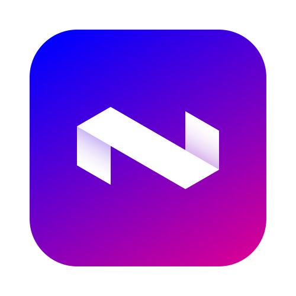

<p align="center">
    
</p>

<h1 align="center">nevo</h1>

<p align="center">
    A modern <strong>SASS</strong> framework. 
</p>

## Quick Start

Install `nevo` via _npm_

```sh
$ npm install --save-dev nevo # yarn add --dev nevo
```

Include `nevo` in your project

```scss
// project/main.scss

@use 'nevo' as *;
```

> The `@use` rule is the primary replacement for `@import`. [More info.](https://sass-lang.com/blog/the-module-system-is-launched)

That's it! 🤙 You’re ready to cook 👨‍🔬

## Documentation

Full documentation is in progress. If you familiar with `SASS/SCSS`, feel free to try `nevo` 🧪

## License

**nevo framework**

Code released under the [MIT License.](LICENSE)

Copyright (c) Ivo Dolenc
