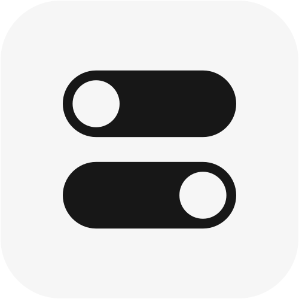

<p align="center">
    
</p>

<h1 align="center">nevo</h1>

<p align="center">
    A modern <strong>SASS</strong> framework for building responsive user interfaces. 
</p>

<br />


<h3>MODERN</h3>

Experience a seamless design process with all the latest `CSS` features and `SASS` benefits. Use many built-in modules and custom solutions which can extend the theme behavior.

<br />


<h3>ADVANCED</h3>

Start creating with your preferred system. Style your website in a `classic` way or build responsive designs directly in HTML usign a modern `utility-first` method. You choose.

<br />


<h3>MODULAR</h3>

Manage a `flexible` structure and decide what best suits your project. You can import everything or select only specific parts to create a unique environment. It’s up to you.

<br />


<h3>MOBILE-FIRST</h3>

Use an `optimized` media query system and easily define a style for each viewport size. Speed up your development process from concept to production in literally minutes.

<br />



<h3>CUSTOMIZABLE</h3>

Take control and quickly `customize` global settings or simply `extend` the framework with powerful built-in solutions. Change the theme preferences exactly to your needs.

<br />

## Quick Start

Install `nevo` via _npm_

```sh
$ npm install --save-dev nevo # yarn add --dev nevo
```

Include `nevo` in your project

```scss
// project/main.scss

@use 'nevo' as *;
```

_The `@use` rule is the primary replacement for `@import`. [More info](https://sass-lang.com/blog/the-module-system-is-launched)_

That's it! 🤙

## Documentation

Full documentation in progress. 🚧

If you're familiar with `SASS/SCSS`, feel free to try `nevo`.

## Additional info

Nevo is inspired by Tailwind CSS, so the naming convention for utilities and development experience in HTML are very similar.

Nevo is a `SASS-powered` framework.

## License

**nevo framework**

Code released under the [MIT License.](LICENSE)

Copyright (c) Ivo Dolenc
